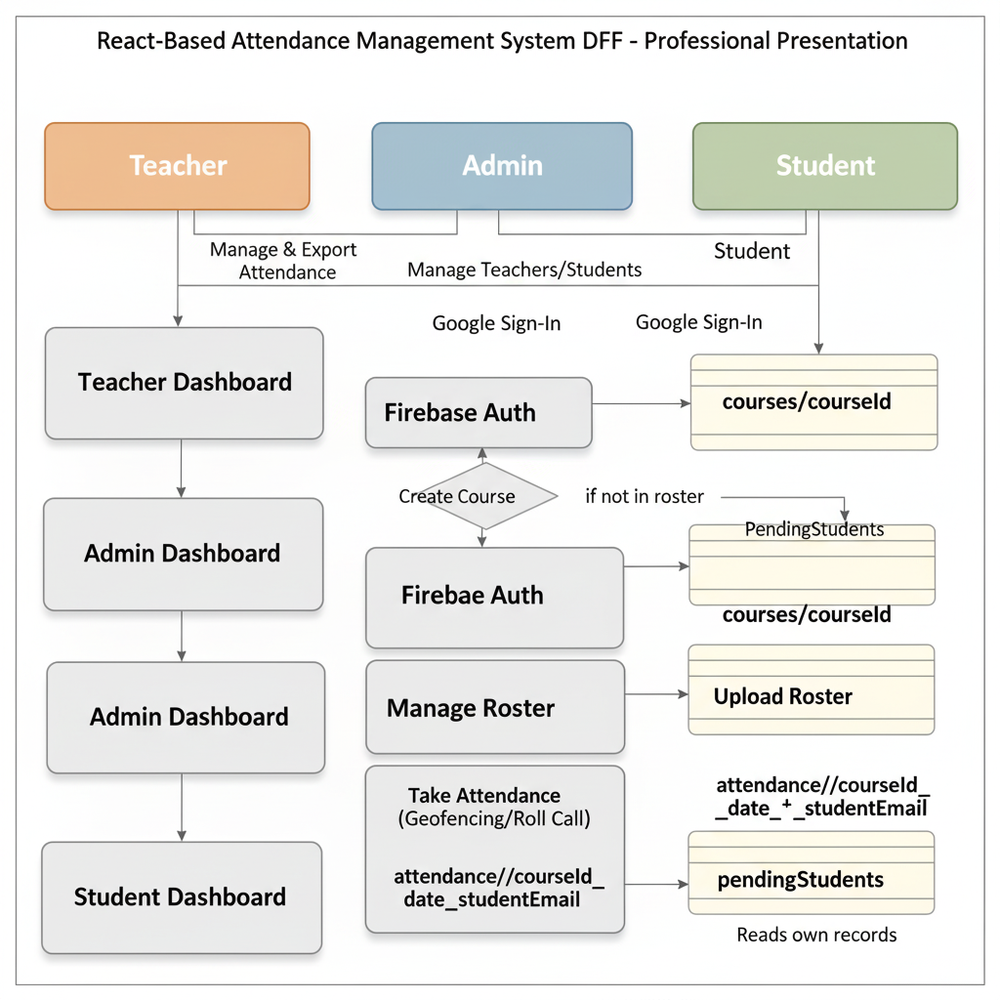

# Visual Route Tree

This document shows the navigation structure of the Class Attendance app for Teacher, Admin, and Student roles.  
It combines a diagram (data flow view) and a textual route tree (quick reference).

---

## Diagram

---

## Textual Route Tree

### Teacher

- `/teacher/dashboard` → **TeacherDashboard**
  - `/teacher/courses/:courseId` → **CourseDetails**
    - `/teacher/courses/:courseId/rollcall` → **RollCall** (take attendance)
    - `/teacher/courses/:courseId/reports` → **CourseAttendanceReport**
  - `/teacher/create-course` → **CourseCreation**
  - `/teacher/add-students` → **AddStudents**

### Admin

- `/admin/dashboard` → **AdminMainArea**
  - `/admin/manage-teachers` → **PendingEnrollmentsManagement**
  - `/admin/manage-students` → **PendingStudentsManagement**
  - `/admin/courses/:courseId` → **CourseDetails** (admin view)

### Student

- `/student/dashboard` → **StudentHome / StudentHomeNew**
  - `/student/courses/:courseId` → **CourseAttendance** (GPS self check-in)
  - `/student/attendance-history` → **AttendanceHistory**

---

## Notes

- All dashboards are gated by **Firebase Auth**.
- Role-based routes are enforced by **AdminRoute**, **StudentRoute**, and **TeacherRoute**.
- Firestore schema references:
  - Courses → `/courses/:courseId`
  - Attendance → `/attendance/:courseId/:dateId/:studentEmail`
  - Pending students → `/pendingStudents`

---

## See Also

- [Naming Map](naming-map.md) — inventory of names to avoid conflicts.
- [Teacher Dashboard Refactor Plan](refactor-teacher-dashboard.md) — strategy and execution plan.

## ASCII Data Flow (Corrected)

                           ┌─────────────────┐
                           │ Firebase Auth   │
                           │ (Google Sign-In)│
                           └───────┬─────────┘
                                   │
             ┌─────────────────────┼───────────────────────┐
             │                     │                       │
      ┌──────▼─────┐         ┌─────▼──────┐          ┌─────▼──────┐
      │  Student   │         │  Teacher   │          │   Admin    │
      └─────┬──────┘         └─────┬──────┘          └─────┬──────┘
            │                      │                       │
            │                      │                       │

┌────────▼────────┐ ┌────────▼─────────┐ ┌─────────▼─────────┐
│Student Dashboard│ │ Teacher Dashboard│ │ Admin Dashboard │
└───────┬─────────┘ └──────┬───────────┘ └───────┬───────────┘
│ │ │
│ │ │
┌───────▼───────────┐ ┌─────▼─────────────┐ ┌──────▼────────────────┐
│ Self Check-in │ │ Create Course │ │ Manage Teachers │
│ (GPS + Time window)│ │ Add Students (CSV)│ │ Approve/Delete/Edit │
│ Writes Attendance │ │ Roll Call (manual)│ │ Manage Students │
└────────┬───────────┘ └─────────┬─────────┘ │ Manage Courses │
│ │ └───────────────────────┘
│ │
┌───────▼───────────┐ ┌───────▼────────────┐
│ Pending Students │ │ Courses/{courseId} │
│ if not in roster │ │ Roster subcoll. │
└────────┬──────────┘ └───────┬────────────┘
│ │
│ │
┌────────▼─────────┐ ┌───────▼───────────────────────────┐
│ Await teacher/ │ │ Attendance/{courseId}/{dateId}/ │
│ admin approval │ │ {studentEmail} (status, ts, mode, │
└──────────────────┘ │ gps) │
└───────────────────────────────────┘
